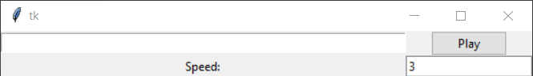
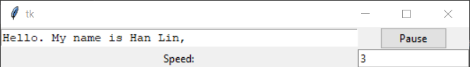

# Script Reading GUI
### Author: Han Lin
Think of it as a close captions tool; help to maintain eye contact with camera during presentations;

### Instructions
- Put your script in the `script.txt` file;
- Activate GUI in the python file [`Read_Script.py`](Read_Script.py)
- Click `Play` button, once you are ready and good with the speed (The speed is how many words added per second; you could change it up - doesn't have to be integer) 

- When you want to pause (script played too fast, click on pause; it will stop for 2 seconds before recontinuing. I'm working on making it stop completely.)
    - Paragraph separations will be indicated by `_____` for ease of reference (Couldn't use `\n` or `\t\t` as GUI will just ignore it...) 

- It will stop once your script it finished playing
